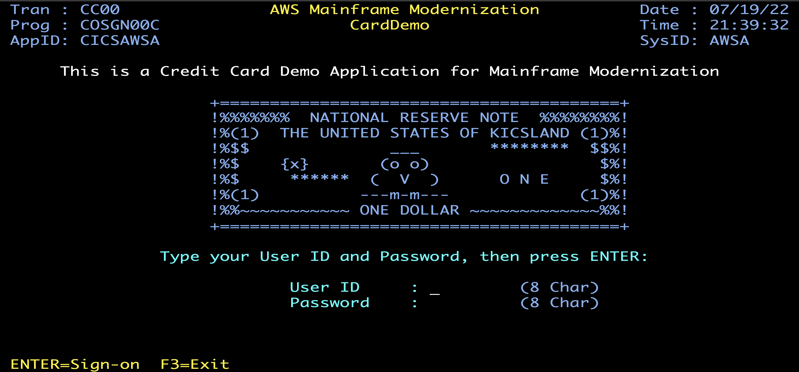
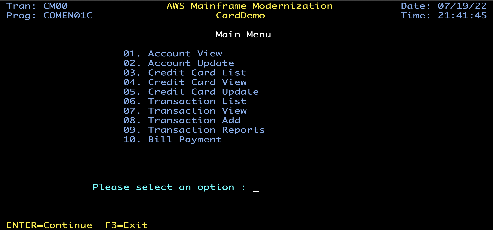

# AWS CardDemo — COBOL → Agentyx Modernization

A **before / after** showcase of mainframe application modernization. This repository
pairs the original AWS mainframe **CardDemo** application (COBOL / CICS / VSAM / JCL /
RACF) with an **Agentyx-generated** Spring Boot / Java modernization of the same
application, so the two can be compared side by side.

> **Purpose:** demonstrate, for evaluation purposes, how Agentyx transforms a legacy
> mainframe codebase into an equivalent modern Java stack — and how that equivalence is
> *verified* rather than assumed.

---

## Repository layout

```
.
├── carddemo-baseline/      # ORIGINAL — AWS CardDemo mainframe application
│   └── aws-carddemo/
│       ├── app/
│       │   ├── cbl/        # 28 COBOL programs (online + batch)
│       │   ├── cpy/        # COBOL copybooks
│       │   ├── bms/        # CICS BMS screen maps
│       │   ├── cpy-bms/    # BMS copybooks
│       │   ├── jcl/        # JCL job control
│       │   ├── proc/       # JCL procedures
│       │   ├── csd/        # CICS resource definitions
│       │   ├── ctl/        # control cards
│       │   └── data/       # sample VSAM data
│       ├── diagrams/       # data model + application flow diagrams
│       └── README.md       # original AWS CardDemo documentation
│
└── carddemo-agentyx/       # MODERNIZED — Agentyx-generated Spring Boot app
    ├── src/main/java/com/carddemo/
    │   ├── domain/         # JPA entities (Account, Card, Customer, Tran, …)
    │   ├── repo/           # Spring Data repositories
    │   ├── service/        # business logic ported from COBOL programs
    │   ├── web/            # REST controllers (online screen equivalents)
    │   ├── batch/          # 28 Spring Batch job configs (JCL equivalents)
    │   ├── security/       # JWT auth (RACF equivalent)
    │   └── config/         # data loading / seeding
    ├── src/main/resources/
    │   ├── application.yml # dev (H2) + postgres profiles
    │   └── db/             # Flyway schema migration + seed data
    ├── src/test/java/      # equivalence / grounded-golden / property tests
    ├── smoke/              # smoke-test scenarios
    └── snapshots/          # equivalence run snapshots
```

---

## The original — `carddemo-baseline`

CardDemo is a mainframe application AWS publishes to exercise mainframe analysis,
migration and modernization tooling. It models a simplified credit-card platform:
account view/update, card list/detail/update, transaction add/list, bill pay, interest
calculation, reporting, and user administration.

**Technology:** COBOL, CICS (online transactions), VSAM (data), JCL (batch), RACF (security).

Representative programs:

| Program    | Role                                  |
| ---------- | ------------------------------------- |
| `COSGN00C` | Sign-on screen                        |
| `COMEN01C` | Main menu                             |
| `COACTVWC` | Account view                          |
| `COACTUPC` | Account update                        |
| `COCRDLIC` | Card list                             |
| `COBIL00C` | Bill pay                              |
| `CBACT04C` | Interest calculation (batch)          |
| `CBTRN02C` | Transaction posting (batch)           |

See [`carddemo-baseline/aws-carddemo/README.md`](carddemo-baseline/aws-carddemo/README.md)
for the full application inventory and screen flows.

### The original mainframe screens (CICS / BMS)

The legacy application is driven through 3270-style green-screen terminals. These are the
screens the modernization reproduces as REST endpoints + UI.

**Sign-on screen** — `COSGN00C` (transaction `CC00`), the RACF-backed login:



**Main menu** — `COMEN01C` (transaction `CM00`), the user function hub:



Each menu option maps to a COBOL program (and, in the modernized app, to a service +
REST controller): Account View → `COACTVWC` / `AccountViewService`, Bill Payment →
`COBIL00C` / `BillPayService`, and so on.

---

## The modernization — `carddemo-agentyx`

The Agentyx-generated target re-implements the same application as a standard Spring Boot
service:

- **Domain / persistence** — VSAM files become JPA entities (`domain/`) over Spring Data
  repositories (`repo/`), with the schema expressed as a Flyway migration
  (`db/migration/V1__schema.sql`) and seed data (`db/seed/data.sql`).
- **Online (CICS) → REST** — each interactive COBOL screen program maps to a REST
  controller in `web/` backed by a `service/` class that carries the ported business
  rules (e.g. `COBIL00C` → `BillPayService`, `CBACT04C` → `InterestService`).
- **Batch (JCL) → Spring Batch** — each batch job has a `*BatchConfig` in `batch/`
  (28 jobs, mirroring the JCL inventory).
- **Security (RACF) → JWT** — `security/` provides JWT auth + filters.
- **Profiles** — runs on in-memory **H2** for `dev` and **PostgreSQL** for `postgres`.

### Verified equivalence (not just a rewrite)

The differentiator of this demo is in `src/test/`: the modernized code ships with tests
that tie it back to the *source* behavior.

- **Grounded-golden tests** (`CardDemoGroundedGoldenTest`) — expected values are computed
  by executing the **source COBOL** (e.g. `COBIL00C` bill-pay, `CBACT04C` interest)
  through the Agentyx COBOL interpreter at emit time, **not** copied from the Java. Each
  test goes red if the Java service diverges from the COBOL rule.
- **Equivalence tests** (`EquivalenceTest`) — generated from recorded scenarios; assert
  the target accepts every source input shape without 5xx.
- **Property tests** (`PropertyTest`) and **branch tests** (`BranchTest`) — broaden input
  coverage and exercise branch behavior.
- **Smoke** (`smoke/`) and **snapshots** (`snapshots/`) capture run-level provenance.

Files carrying an `[agentyx-provenance v1]` header are machine-generated by the Agentyx
`cobol_cics_to_springreact` emitter.

---

## Building & running the modernized app

> **Note:** `carddemo-agentyx` was generated and built in the Agentyx pipeline; this
> snapshot contains the generated **sources** but **not** the Maven `pom.xml` (the build
> configuration lives in the generator and was not exported with this snapshot). To build
> and run locally, add a Spring Boot `pom.xml` declaring the dependencies the sources use
> (Spring Boot Web, Data JPA, Batch, Security/JWT, Flyway, H2, PostgreSQL driver) and
> then:

```bash
cd carddemo-agentyx
mvn spring-boot:run            # dev profile, H2 in-memory, http://localhost:8080
# or target PostgreSQL:
mvn spring-boot:run -Dspring-boot.run.profiles=postgres
```

The H2 console is enabled under the `dev` profile.

---

## License

This repository is licensed under the **Apache License, Version 2.0** — see
[`LICENSE`](LICENSE) and [`NOTICE`](NOTICE).

| Path                 | Work                                         | Copyright                                 | License    |
| -------------------- | -------------------------------------------- | ----------------------------------------- | ---------- |
| `carddemo-baseline/` | Original AWS CardDemo (COBOL/CICS/VSAM/JCL)  | Amazon.com, Inc. or its affiliates        | Apache-2.0 |
| `carddemo-agentyx/`  | Agentyx-generated modernization (derivative) | lionsagentix                              | Apache-2.0 |

`carddemo-agentyx/` is a **derivative work** of the AWS CardDemo application, transformed
from COBOL to a Spring Boot / Java stack. Per Apache 2.0, the original copyright and
attribution notices are retained in [`NOTICE`](NOTICE) and in
[`carddemo-baseline/aws-carddemo/NOTICE`](carddemo-baseline/aws-carddemo/NOTICE).

"AWS" and "Amazon" are trademarks of Amazon.com, Inc.; this license grants no rights to
those marks beyond describing the origin of the work.
